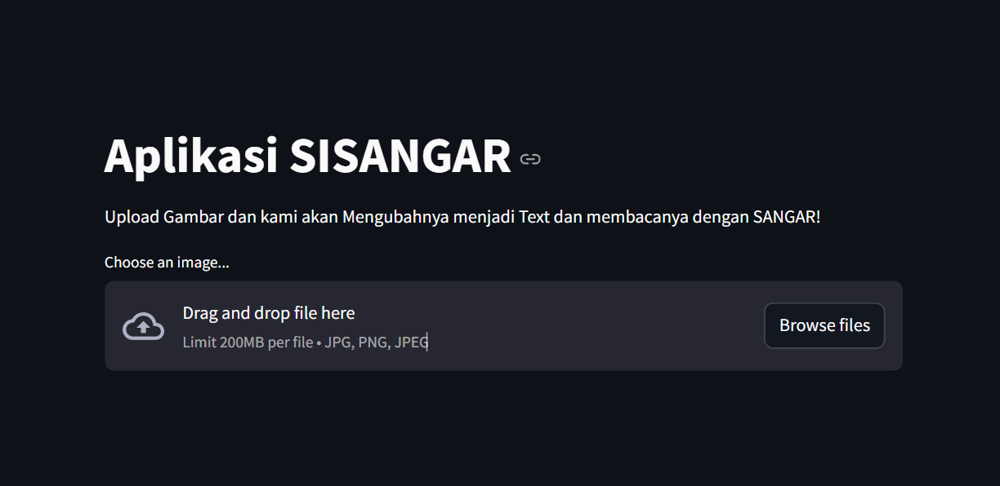

# Image to Text & Speech Converter

## Table of Contents
- [Introduction](#introduction)
- [Purpose](#purpose)
- [Features](#features)
- [Installation](#installation)
- [Usage](#usage)
- [Dependencies](#dependencies)
- [License](#license)

## Introduction
**Image to Text & Speech Converter** is a web application designed to help users extract text from an uploaded image and convert it into speech. This tool is especially beneficial for visually impaired users, allowing them to hear the text content from images. The application is built using **Streamlit**, and the core functionalities include Optical Character Recognition (OCR) via **Tesseract** and text-to-speech conversion using **gTTS** (Google Text-to-Speech).

## Purpose
The purpose of this project is to provide an easy-to-use interface where users can upload images, extract text, and have it read out loud automatically. The application could be useful in several scenarios, such as:
- Assisting the visually impaired by reading the text from images.
- Converting scanned documents or images with text into readable or spoken content.
- Quick and easy text extraction from images for research or personal use.

## Features
- **Image Upload**: Users can upload image files in formats like JPG, PNG, or JPEG.
- **Text Extraction**: The application uses **Tesseract** OCR to detect and extract text from the uploaded image.
- **Text-to-Speech**: Converts the extracted text into speech using **gTTS**, allowing users to listen to the text content.
- **Audio Playback**: Users can play the extracted text in audio format directly from the application.
- **Clean Design**: Simple and intuitive user interface with Streamlit.

## Installation
Follow these steps to get the application up and running on your local machine.

### Prerequisites
Make sure you have **Python 3.8+** installed and have set up a virtual environment (optional but recommended).

### Steps
1. **Clone the repository**:
   ```bash
   git clone https://github.com/arimaulanahardan/image-to-text-speech.git 
   cd image-to-text-speech
   ```

2. **Install dependencies**:
   Ensure all required Python libraries are installed by running:
   ```bash
   pip install -r requirements.txt
   ```

3. **Install Tesseract**:
   - For **Windows**, download and install from [this link](https://github.com/UB-Mannheim/tesseract/wiki).
   - For **Linux** (Ubuntu):
     ```bash
     sudo apt-get install tesseract-ocr
     ```
   - For **MacOS** (with Homebrew):
     ```bash
     brew install tesseract
     ```

4. **Set Tesseract Path**:
   If you're using **Windows**, ensure you add the Tesseract installation path to your environment variables or specify it in your code:
   ```python
   import pytesseract
   pytesseract.pytesseract.tesseract_cmd = r'C:\Program Files\Tesseract-OCR\tesseract.exe'
   ```

5. **Run the application**:
   Once everything is set up, run the application using **Streamlit**:
   ```bash
   streamlit run app.py
   ```

## Usage

### 1. User Flow
- **Step 1**: Navigate to the local URL where the application is hosted (usually `http://localhost:8501`).
- **Step 2**: Upload an image by clicking the "Choose an image..." button.
- **Step 3**: Once the image is uploaded, the application will:
  - Display the uploaded image.
  - Extract text from the image and display it.
- **Step 4**: Click the "Play Text as Speech" button to convert the text to audio and hear it.
- **Step 5**: The application will play the audio of the extracted text.

### 2. Supported File Types
- The application supports the following image formats:
  - `.jpg`, `.jpeg`, `.png`

### 3. Example Scenarios
- Scanning printed documents to extract text.
- Reading text from images for the visually impaired.
- Quickly converting image text to speech for review or study.


## Dependencies
The project uses the following main libraries:
- **Streamlit**: For building the web interface.
- **Pillow**: For image processing.
- **Pytesseract**: For Optical Character Recognition (OCR).
- **gTTS**: For converting text to speech.

You can install all dependencies by running:
```bash
pip install -r requirements.txt
```

### Example `requirements.txt`:
```
streamlit
pillow
pytesseract
gTTS
```

## License
This project is licensed under the MIT License. See the [LICENSE](LICENSE) file for details.

## Overview
